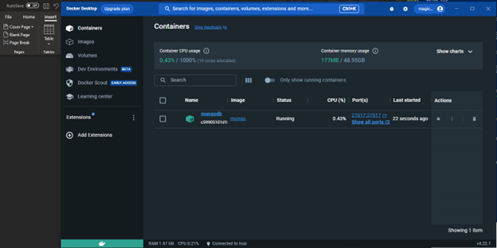

**1-3 Assignment: Installation, MongoDB Image, and Testing** 
*Rowan Stratton* 
*Southern New Hampshire University* 
*CS-465-X6172 Full Stack Development I 23EW6* 
*Professor Nizar Dajani* 
*August 29, 2023* 
  
  
•	Screenshot of the Docker dashboard to show that the application is running 
   
•	Screenshot showing that the Docker run command is functioning
•	 
•	 
•	Optional Extension Activity:
•	 
•	 
•	I have the container running – but no MongoDB because the image that I chose is NOT a supported image. I failed to realize this until after I created the container. 
