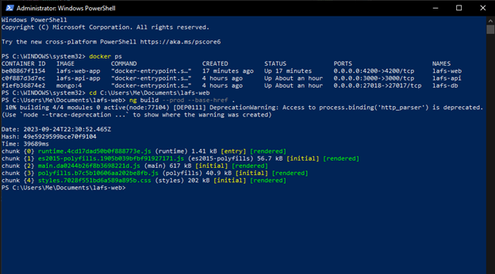
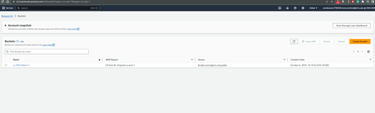
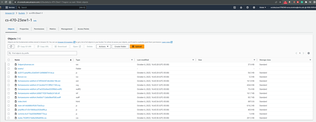
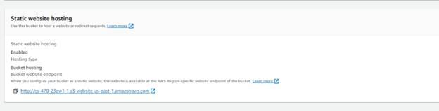
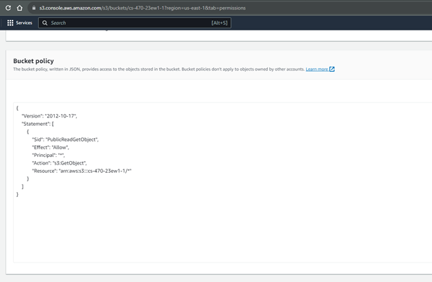

## **3-1 Assignment: Create a Static Website on S3** 
*Rowan Stratton* 
*Southern New Hampshire University* 
*CS-470-R1926 Full Stack Development II 23EW1* 
*Professor Nizar Dajani* 
*September 24, 2023*   

### **Screenshots:**  
*Link: http://cs-470-23ew1-1.s3-website-us-east-1.amazonaws.com/*  
 Building an Angular Application for Deployment: 
   

 Created an S3 Bucket for the Angular Application: 
  

Added Files to created S3 bucket: 
  

Deployed site and updated security permissions for public view:  
 
  

Created a Bucket Policy to enable read access permissions: 
 

 
 
 
 
