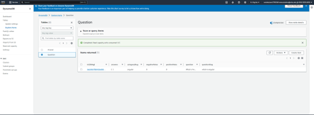

## **5-2 Assignment: Creating the Database**  
*Rowan Stratton*  
*Southern New Hampshire University*  
*CS-470-R1926 Full Stack Development II 23EW1*  
*Professor Nizar Dajani*  
*October 06, 2023*    

### *Screenshots:*   

 Question and Answer Table Created and shown with the first added item displayed on the Question Table:  
   

  View displaying item entered. Created new item in Question Table with JSON:  
  { 
  "id": "5eb59b7f80433e00045a7dfb", 
  "categorySlug": "angular", 
  "questionSlug": "what-is-angular", 
  "question": "What is Angular", 
  "negativeVotes": 0, 
  "positiveVotes": 0, 
  "answers": [] 
}  
This created: 
  
   

  The first added item displayed on the Answer Table:  
   

   View displaying item entered. Created new item in Question Table with JSON:  
{ 
    "answer": "Because it is the backbone of angular", 
    "negativeVotes": 0, 
    "positiveVotes": 0, 
    "id": "5b8629d2af53c20004793ac0", 
    "questionId": "5eb59b7f80433e00045a7dfb" 
} 
  
This created: 
   
   

 
 
 
 
 
 

