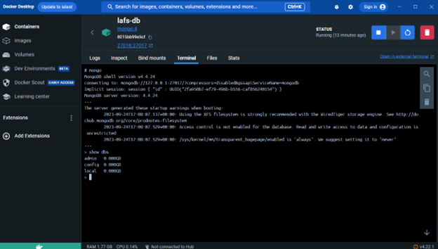
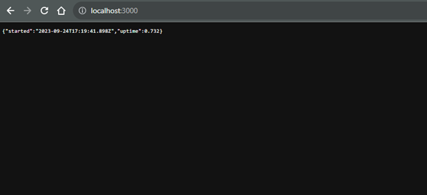
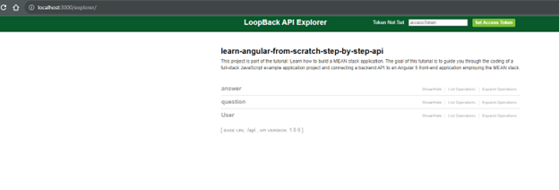

**2-3 Assignment: Docker Compose and Orchestration** 
*Rowan Stratton* 
*Southern New Hampshire University* 
*CS-470-R1926 Full Stack Development II 23EW1* 
*Professor Nizar Dajani* 
*September 16, 2023*  

**Screenshots:**  
Network create – trying to solve port issues as port 27017 was in use already.   
   
Changed file to look for additional port if 27017 is in use.  
   
Next issue I had was with the naming of the database. Mine was called mongo, not my-mongo. It took me a long time to figure out how to reflect these changes but I changed my config.json and datasources.json file:  
  
   
Finally I had to make these changes to my docker-compose.yml file:  
  
  
   
Docker Containers:  
  
   
Testing containers: 
  
 
http://localhost:3000/explorer  
  
Testing REST API:  
  
  
  
  
  
  
 
 
 
 
 

