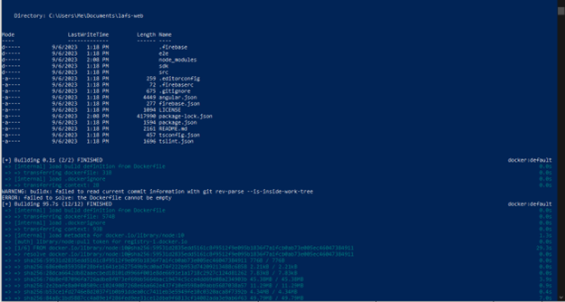
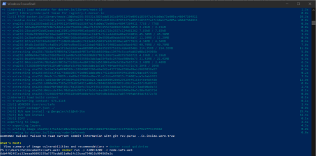
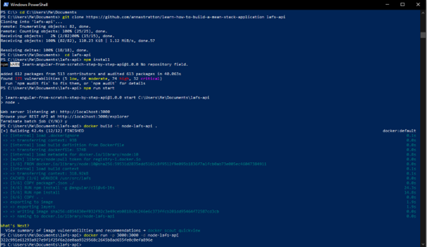
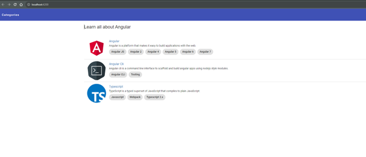
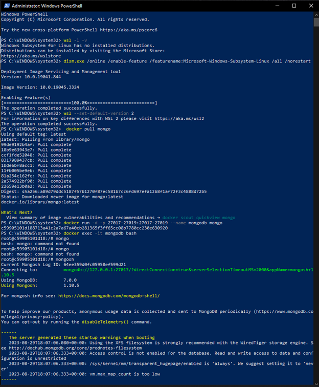
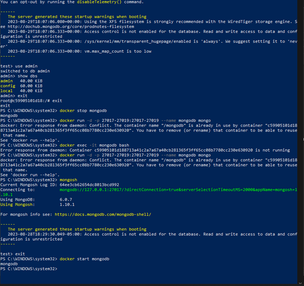
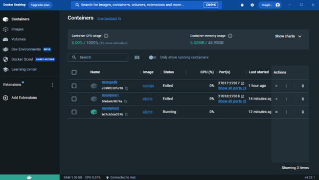
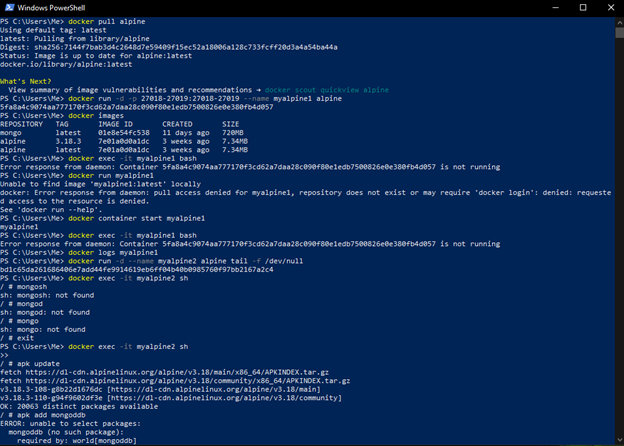

**2-2 Assignment: Docker Containerization** 
*Rowan Stratton* 
*Southern New Hampshire University* 
*CS-470-R1926 Full Stack Development II 23EW1* 
*Professor Nizar Dajani* 
*September 06, 2023*   
 
•	Submit the following screenshots to Brightspace: 
•	Docker images command output: lafs-web) 
 
  

•	Lafs-api 
   
•	Screenshot showing that the Docker run command is functioning 
  
  
   

•	Optional Extension Activity: 
  
  

•	I have the container running – but no MongoDB because the image that I chose is NOT a supported image. I failed to realize this until after I created the container. 
