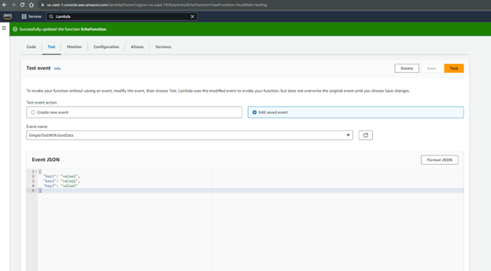
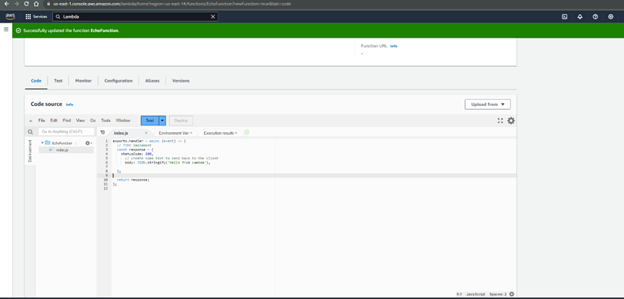
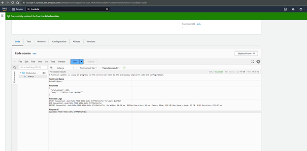
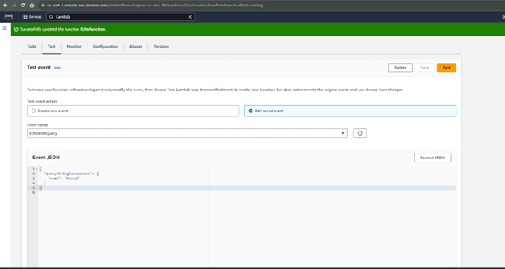
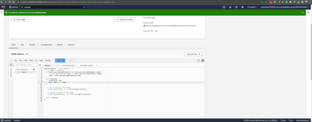
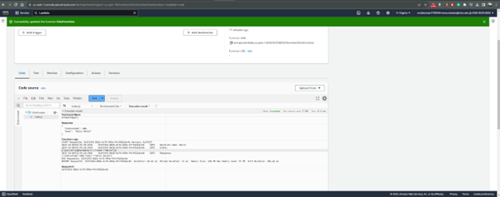

## **4-3 Assignment: Lambda and Gateway API** 
*Rowan Stratton* 
*Southern New Hampshire University* 
*CS-470-R1926 Full Stack Development II 23EW1* 
*Professor Nizar Dajani* 
*October 06, 2023*   

### *Screenshots:*  
From the created EchoFunction this is the test event called "SimpleTestWithJsonData": 
  

Updated the Lambda function and received a notification at the top showing update is completed: 
  

Test indicating run success:  
  

Modified code within the Echo Function which will pull the values within the SimpleTestWIthJasonData: 
  

Modified code again to fit the created EchoWithQuery event to search and pull the parameters:  
 
 
  

 
 
 
 
 
 
 
 
