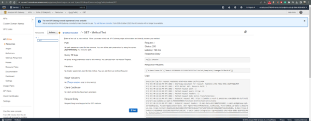
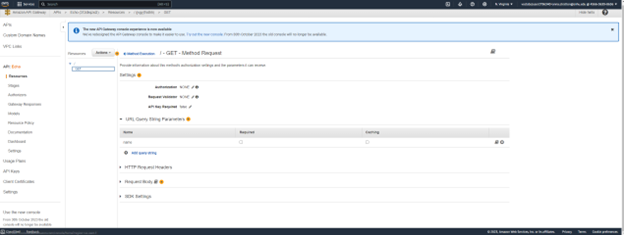
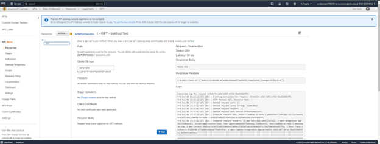
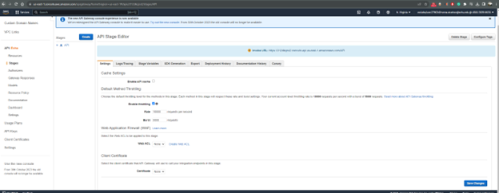
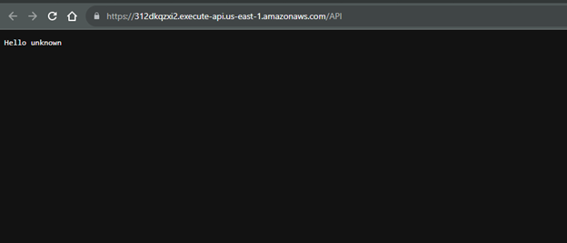
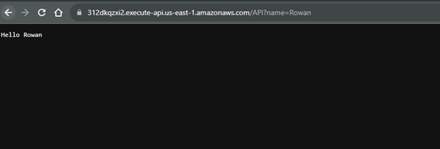

## **4-4 Assignment: Testing Lambda and Gateway API** 
*Rowan Stratton* 
*Southern New Hampshire University* 
*CS-470-R1926 Full Stack Development II 23EW1* 
*Professor Nizar Dajani* 
*October 06, 2023*   

### **Screenshots:**   
 Created API called Echo and added GET Method linking the previously created Lambda function EchoFunction:  
  

 GET Method testing the Lambda Method:  
  

 Added a Query string to search for name:  
   

Tested GET Method again with the updated query string: 
 

Deployed the API the Invoke URL shown below:  
 

Showing the output of what going to the URL does:  
 

URL conditions changed: 
 
 

 Invoke URL: 
https://312dkqzxi2.execute-api.us-east-1.amazonaws.com/API?name=Rowan

