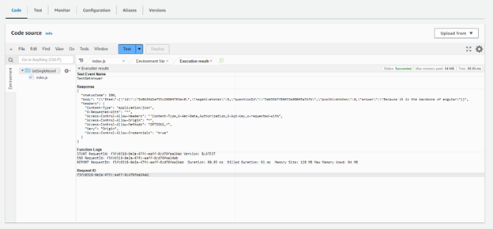
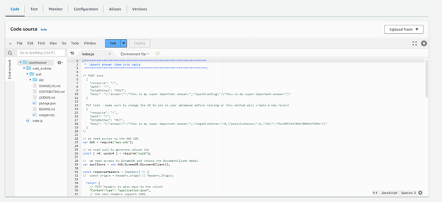

## **5-3 Assignment: Using the Database** 
*Rowan Stratton* 
*Southern New Hampshire University* 
*CS-470-R1926 Full Stack Development II 23EW1* 
*Professor Nizar Dajani* 
*October 06, 2023*  

# *Screenshots:* 
## Three test runs for Part One: QuestionWithoutFilter, QuestionWithFilter, and AnswerWithoutFilter: 
*QuestionWithoutFilter:* 
 
    
  
*QuestionWithFilter:* 
  
   
 
*AnswerWithoutFilter:* 
   
    
 
## Two test runs for Part Two: TestGetQuestion and TestGetAnswer: 
*TestGetQuestion:* 
  
   
 
*TestGetAnswer:* 
  
   
 
## The directory structure and index.js file in the Lambda window for UpsertQuestion and UpsertAnswer (See Part Three, Step 8 in the guide.): 
*UpsertQuestion:* 
   
 
*UpsertAnswer:* 
   
 
##Two test runs for Part Three: TestInsertQuestion and TestInsertAnswer  

*TestInsertQuestion:*  

   
   
 
*TestInsertAnswer:*  

  
    
 
## Two test runs for Part Four: TestDeleteQuestion and TestDeleteAnswer: 

*TestDeleteQuestion:* 

   
   
   
 
 
*TestDeleteAnswer:* 
   
   
   
 
 
JSON policy: 
Click on the Permissions tab on any of the Lambdas. 
Click the role name. 
Click the policy name. 
Take the screenshot: 
This last screenshot is only to show competency. I was able to complete the part of the assignment creating this policy, but I could not attach. As per the updated assignment instructions I do not need to attach this to LabRole, as it is already updated.   
    

